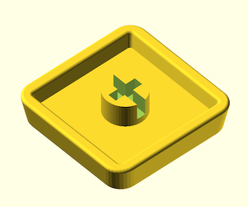
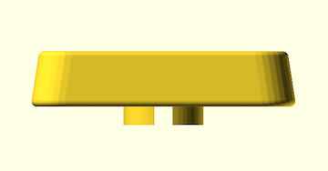

# キーキャップ

私は [Bambu Lab A1 mini](https://us.store.bambulab.com/products/a1-mini) でプリントしています。

## Low Profile MX

ロープロファイルキーキャップ。Kailh Choc v2 で使っています。

## 必要なライブラリ

- [BOSL2](https://github.com/BelfrySCAD/BOSL2)

## ライセンス

ゼロ条項 BSD ライセンスです
