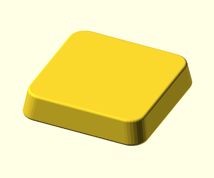
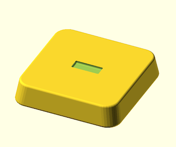
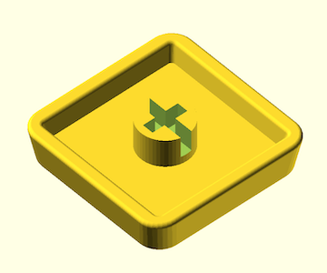
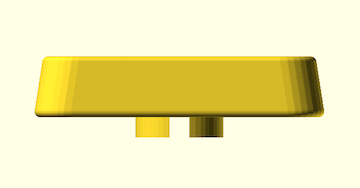

# Keycaps

I print by [Bambu Lab A1 mini](https://us.store.bambulab.com/products/a1-mini) 3D Printer.

## Low Profile MX

I used for Kailh Choc v2 .

## REQUIREMENT

- [BOSL2](https://github.com/BelfrySCAD/BOSL2)

## LICENSE

Zero-Clause BSD LICENSE
