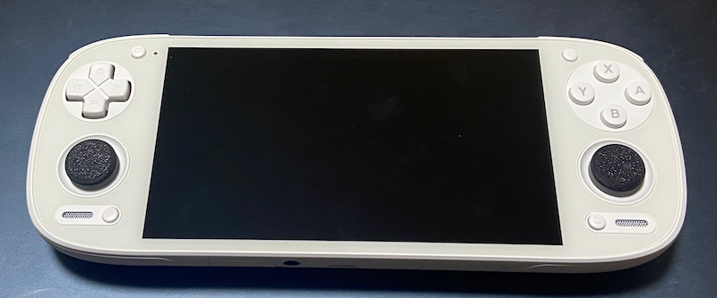
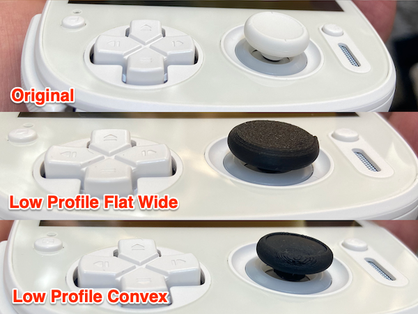
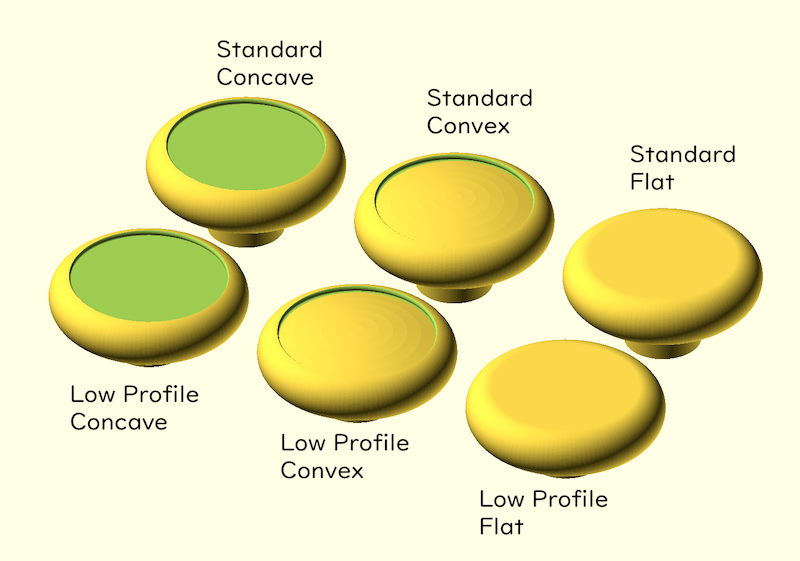
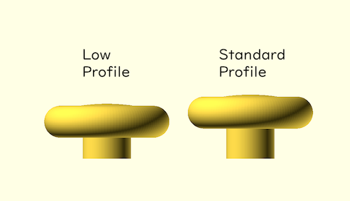
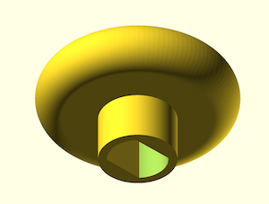

# Retroid Pocket 5 アナログスティックキャップ

[Retroid Pocket 5](https://www.goretroid.com/products/retroid-pocket-5-handheld) 用のアナログスティックキャップです。
オリジナルと交換して利用します。
私は [Bambu Lab A1 mini](https://us.store.bambulab.com/products/a1-mini) でプリントしています。

## 必要なライブラリ

- [BOSL2](https://github.com/BelfrySCAD/BOSL2)

## ライセンス

ゼロ条項 BSD ライセンスです

## 関連サイト

MakerWorld: https://makerworld.com/en/models/1140934