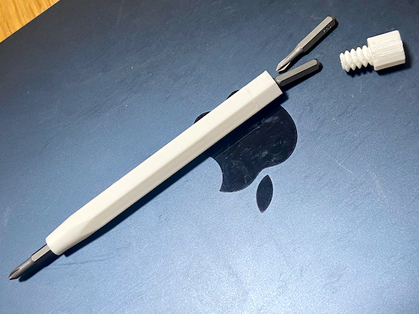
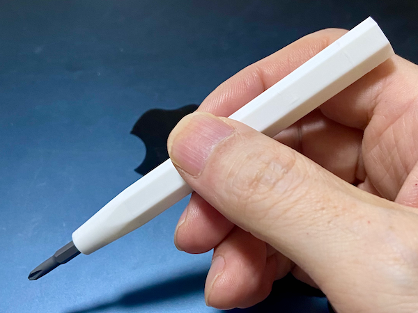

# screw-driver

Screw-driver shaft that can hold two or three bits. 
Bits size is

- 5mm diameter hexagonal
- 28mm log

## LICENSE

- screw-driver.scad is MIT License

- Using threads-library-by-cuiso-v1.scad

  > OpenScad library. Threads for screws and nuts V1by Cuiso is licensed under the Creative Commons - Attribution license.
  > https://www.thingiverse.com/thing:3131126

  

